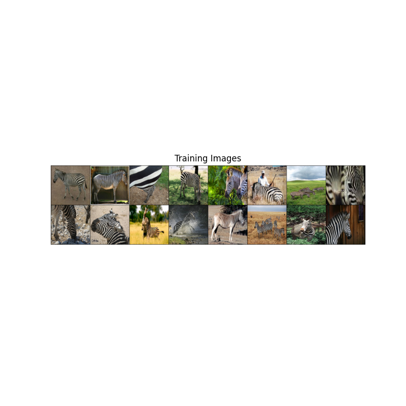
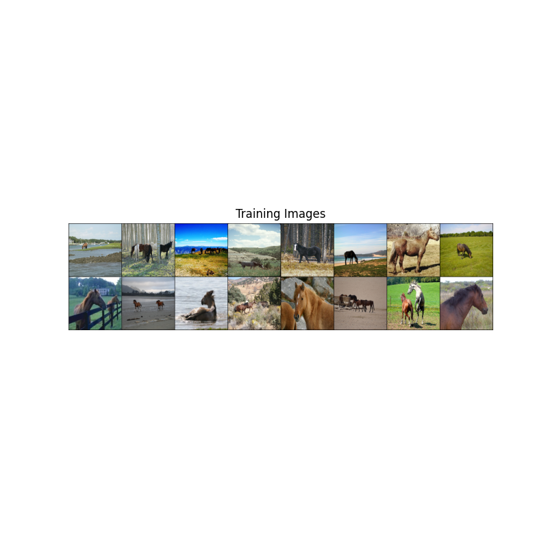
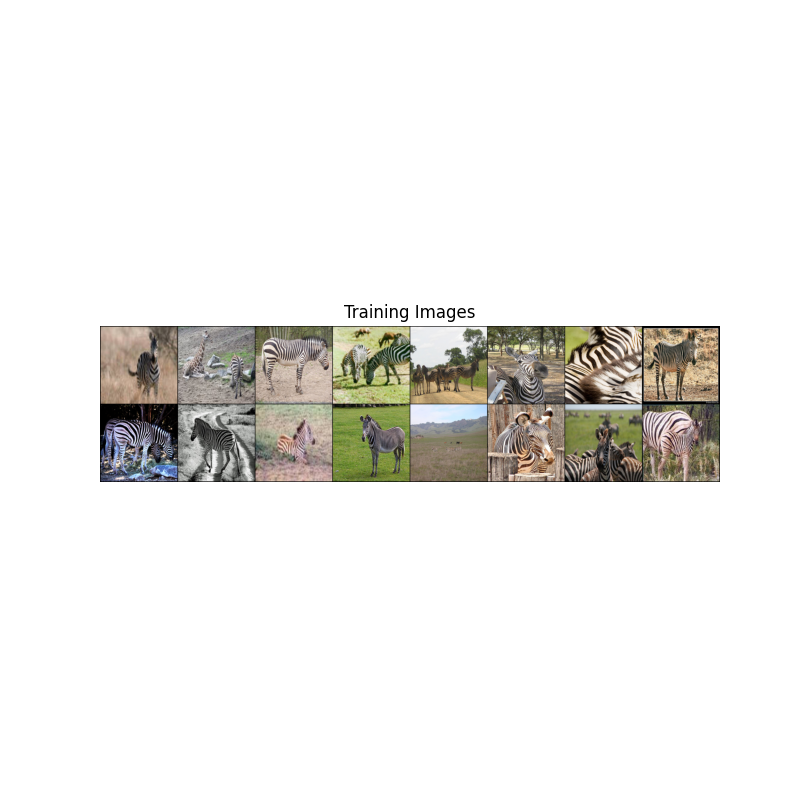
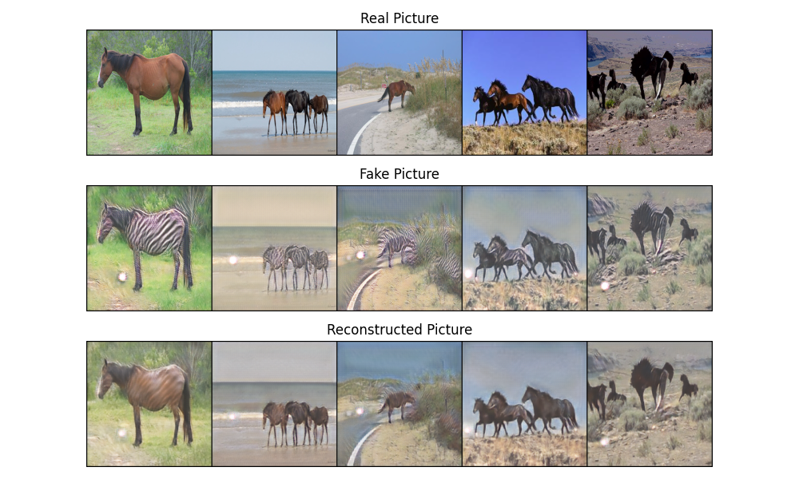

# CycleGAN Project

## Introduction
CycleGAN is a groundbreaking approach that enables the transformation of images from one domain to another without paired examples. This technique has vast applications, including but not limited to style transfer, photo enhancement, and in domains where paired training data is not available. Our implementation focuses on providing a user-friendly, highly customizable framework to explore the capabilities of CycleGAN in various domains.
- the example images
        
        
        
        
## File structure
```
├── config.py                      # Configuration file containing parameters for model training and testing, such as learning rate, batch size, etc.
├── cycleGANDatasetManager.py      # Dataset manager for loading and preprocessing the training and testing datasets.
├── dataset_sample                 # Sample dataset directory with some sample data for quick testing or demonstration purposes.
│   ├── horse_testing_data.png     # Sample testing data for horses.
│   ├── horse_training_data.png    # Sample training data for horses.
│   ├── zebra_testing_data.png     # Sample testing data for zebras.
│   └── zebra_training_data.png    # Sample training data for zebras.
├── loss_function.py               # Loss function file, defining the loss functions used during the model training process.
├── main.py                        # Main execution file to start the entire training or testing process.
├── model                          # Model weights directory, storing the weights of the models after training.
│   ├── basic_training200_Horse2ZebraGenerator.pth  # Weights for the generator that converts horses to zebras.
│   ├── basic_training200_HorseDiscriminator.pth    # Weights for the discriminator for horses.
│   ├── basic_training200_Zebra2HorseGenerator.pth  # Weights for the generator that converts zebras to horses.
│   └── basic_training200_ZebraDiscriminator.pth    # Weights for the discriminator for zebras.
├── model.py                       # Model definition file, defining the generator and discriminator network structures of CycleGAN.
├── origin_version                 # Original version directory, may contain initial or reference implementation notebook files.
│   └── CycleGAN.ipynb             # Original CycleGAN implementation notebook, possibly for quick reference or demonstration.
├── reference.py                   # Reference or utility functions file, may contain auxiliary functions such as image saving, logging, etc.
├── result                         # Results directory, storing images or other output files generated by the model.
│   ├── Horse2Zebra.png            # Example output of the model converting a horse to a zebra.
│   └── Zebra2Horse.png            # Example output of the model converting a zebra to a horse.
└── train.py                       # Training script, containing the complete model training process.

```

## Installation
To use this CycleGAN implementation, you need to have Python 3.6 or later installed on your system. Follow these steps to set up the environment:
1. Clone this repository:
```
git clone https://github.com/Botang-Liao/GAN-CycleGAN.git
```
2. Navigate to the cloned directory:
```
cd CycleGAN
```
3. Install the required dependencies:
```
pip install -r requirements.txt
```

## Usage
To run a CycleGAN model with your data or our preconfigured datasets, use the following command:
```python
python main.py
```

You can monitor the training progress in TensorBoard by navigating to the logs directory created during training.

## Results
The trained models, along with their outputs, will be saved in the `results` directory. This includes transformation examples from both domains and the loss metrics over the training period.

-  the transformation shifted from horse to zebra, and then it repeated, moving from horse to zebra once again.
    

## References
This CycleGAN implementation is inspired by the original paper:
- Zhu, Jun-Yan, et al. "Unpaired Image-to-Image Translation using Cycle-Consistent Adversarial Networks." ICCV 2017.

## Acknowledgments
Special thanks to the CycleGAN contributors and the open-source community for making the resources available. This project was developed for educational purposes and is open for further improvements and contributions.

